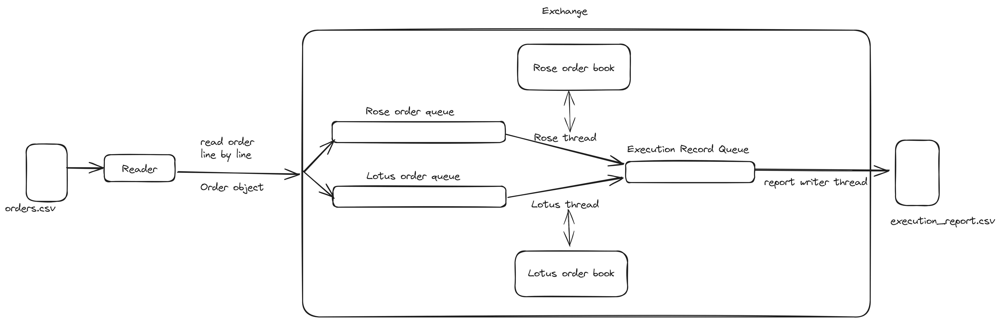

# Flower Exchange App

## Description

This is a simple app written in C++ to simulate a flower exchange. It uses the basic logic used in order books to match buy and sell orders.

The program takes an input csv file with buy and sell orders and outputs a csv file with the execution records.

Example input file:

```csv
client_order_id,instrument,side,quantity,price
aa13,Rose,2,100,55.00
```

Example output file:

```
orderId,clientOrderId,instrument,side,status,quantity,price,reason,transactionTime
ord1,aa13,Rose,2,NEW,100,55.00,,20231215-130627.121
```

Several sample files for input are included in the `sample_files` directory.

## Setup

To run the app locally, clone the repo and run following commands in the root directory of the project:

```bash
# Build the project
make

# Run the app
build/app.exe <path_to_input_file> <path_to_output_file>
```

## High-level Architecture of the App




## App Logic

The app uses the following logic to match buy and sell orders:

Exchange app maintains an order book for each instrument (flower type). The order book has two sides: Buy, Sell.

Initially, the order book is empty. 

An order **X** (already in the order book) is a *matching order* to an incoming:
- **buy order** if the order **X** has a price less than or equal to the desired price
- **sell order** if the order **X** has a price greater than or equal to the desired price

When order book receives an order and no matching order is found:
- The order will go inside the respective side of the order book, and an execution record with status "NEW" will be generated.

When a better order (sell/buy) is received and no matching order is there, it will be listed higher in the respective side.
- Lower the price, a sell order is better. (Thinking from a buyers perspective) - sell side price is in ascending order
- Higher the price, a buy order is better. (Thinking from a sellers perspective) - buy side price is in descending order
- If the prices are same, orders will be listed according to the arrived order. (earlier came, higher in the list)

When an order is received and matching order is there,
- Execute both orders and generate execution records. **The orders will be executed at the price of the matched order already in the order book.** Execution record status will be determined by how the quantity of each order is fulfilled. 
	- If desired quantity fulfilled, status will be "FILL"
	- If partially fulfilled, status will be "PFILL"
- The fulfilled orders are removed from the order book and remaining quantities of the orders already in the book will be kept.
- The incoming order will continue to match orders in the order book until there is no matching order found. The remaining quantity of the incoming order will be added to the order book.
- Assume execution record is generated for the order in the order book before the other order.

We call an order a *passive order* if it goes into the order book without executing. An *aggressive order* is an incoming order which executes. (Here *executing* means at the end we are generating a execution record with "FILL" or "PFILL")

An order will be rejected if:
- it does not contain a required field
- it is for an invalid instrument
- it contains an invalid side
- its quantity is not a multiple of 10
- its quantity is outside the range (min = 10, max = 1000)
- its price is not greater than 0

A "REJECTED" execution record is generated when validations are failed